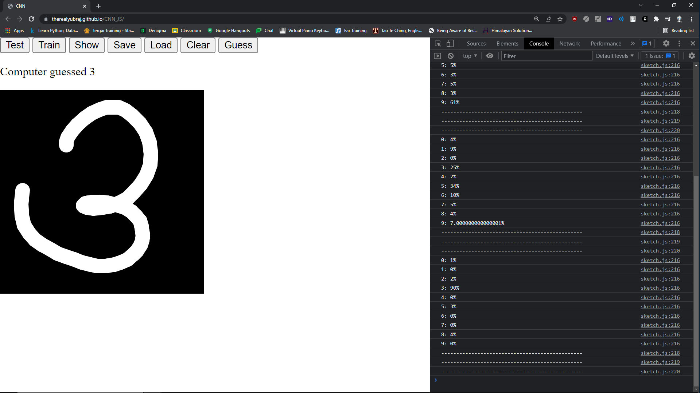

# CNN_JS
CNN implementation in p5.js from scratch built on top of neural network!!

This is an example run on the MNIST dataset of handwritten digits.
The file: brain.json contains a pre trained network. Accuracy: 80%

You can visit https://therealyubraj.github.io/CNN_JS/ to run the project on your browser.
